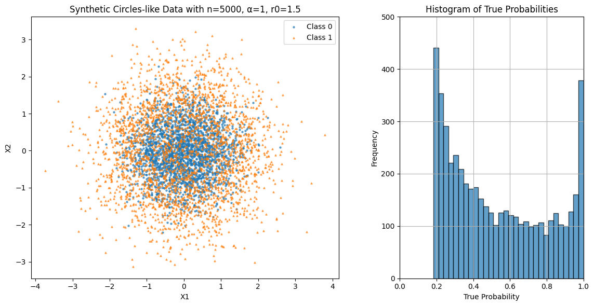

# Data-Generation Process

Let $x_i=(X_{1,i},X_{2,i})^\top$ with $X_{1,i},X_{2,i}\overset{\text{iid}}{\sim}\mathcal N(0,1)$.
Given a score (linear predictor) $\eta_i$, define the class probability

$$
\rho_i \;=\; \sigma(\eta_i)\;=\;\frac{1}{1+\exp(-\eta_i)},
$$

and draw the label $y_i \sim \mathrm{Bernoulli}(\rho_i)$.
Throughout, $\alpha>0$ controls how sharp the transition is and $r_0>0$ sets the decision boundary. By construction, $\rho_i=\tfrac12$ exactly on the boundary, $\eta_i=0$.

---

## Circle dataset

Set

$$
\eta_i \;=\; \alpha\big(\,\lVert x_i\rVert_2^2 - r_0\,\big)\,,
\quad\text{so that}\quad
\rho_i \;=\; \frac{1}{1+\exp\!\big(-\alpha(\lVert x_i\rVert_2^2 - r_0)\big)}.
$$

Here the decision boundary is the circle $\lVert x\rVert_2^2=r_0$ (i.e., radius $\sqrt{r_0}$):

* If $\lVert x_i\rVert_2^2<r_0$ (inside the circle), then $\eta_i<0$ and $\rho_i<0.5$.
* If $\lVert x_i\rVert_2^2>r_0$ (outside the circle), then $\eta_i>0$ and $\rho_i>0.5$.

(If you prefer $y=1$ to correspond to “inside” rather than “outside,” flip the sign of $\alpha$ or swap class labels.)

**Effect of $\alpha$**

* As $\alpha\to\infty$, $\sigma(\eta)$ approaches a step function at radius $\sqrt{r_0}$: points just inside get $\rho_i\approx 0$, just outside $\rho_i\approx 1$.
* For small $\alpha$, the transition is gradual, creating a fuzzy band around the circle where $\rho_i$ moves smoothly from 0 to 1.

 

**Notation (clarification)**

$$
\|x_i\|_2^2 \text{ denotes the squared Euclidean norm of } x_i.
$$

If $x_i=(X_{1,i},X_{2,i})^\top$, then

$$
\|x_i\|_2^2 = X_{1,i}^2 + X_{2,i}^2,
$$

which is the squared distance from the origin. In polar coordinates this equals $r^2$; hence the boundary $\|x\|_2^2=r_0$ is the circle of radius $\sqrt{r_0}$. (More generally, for $x_i\in\mathbb{R}^d$, $\|x_i\|_2^2=\sum_{j=1}^d X_{j,i}^2$.)

---

## Absolute-value (diamond) dataset

Analogously, use the $\ell_1$ “radius” to obtain a diamond-shaped boundary:

$$
\eta_i \;=\; \alpha\big(\,|X_{1,i}|+|X_{2,i}| - r_0\,\big),
\quad\text{so}\quad
\rho_i \;=\; \frac{1}{1+\exp\!\big(-\alpha(|X_{1,i}|+|X_{2,i}| - r_0)\big)}.
$$

The decision boundary is the diamond $|x_1|+|x_2|=r_0$:

* If $|X_{1,i}|+|X_{2,i}|<r_0$, then $\rho_i<0.5$;
* If $|X_{1,i}|+|X_{2,i}|>r_0$, then $\rho_i>0.5$.

As before, $\alpha$ governs the sharpness of the transition.

