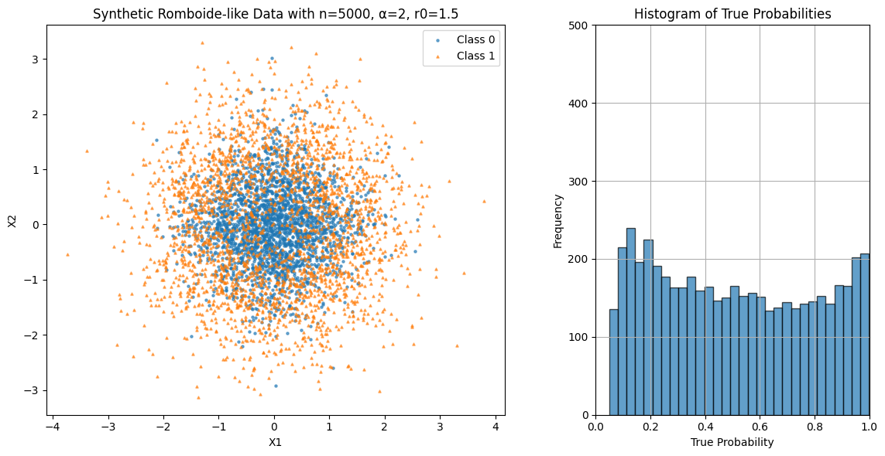
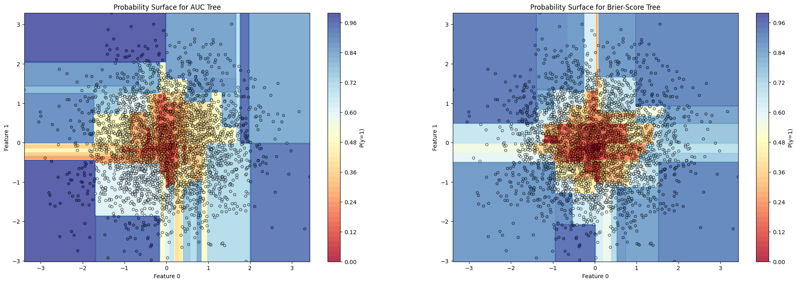
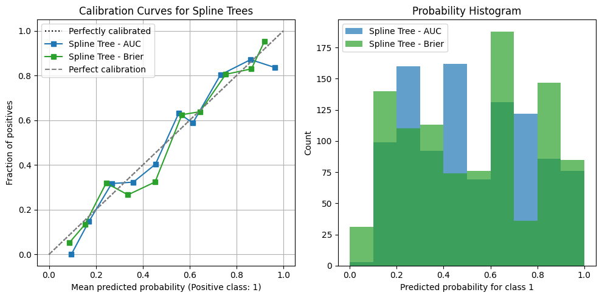
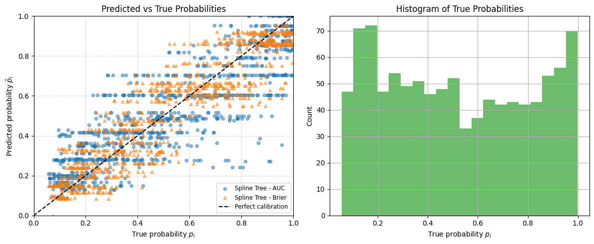
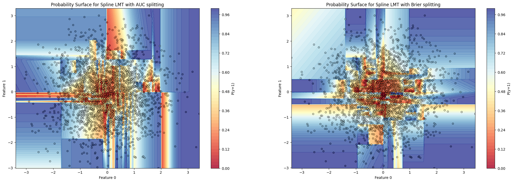
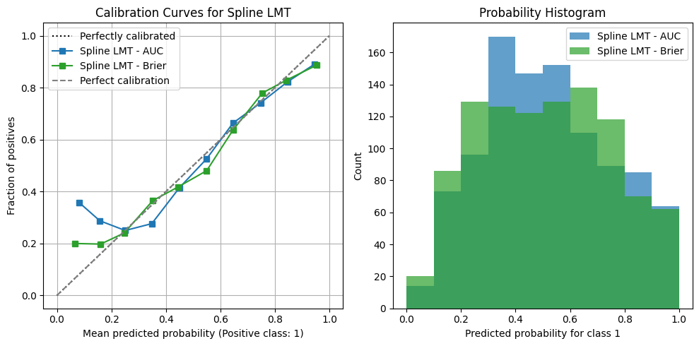
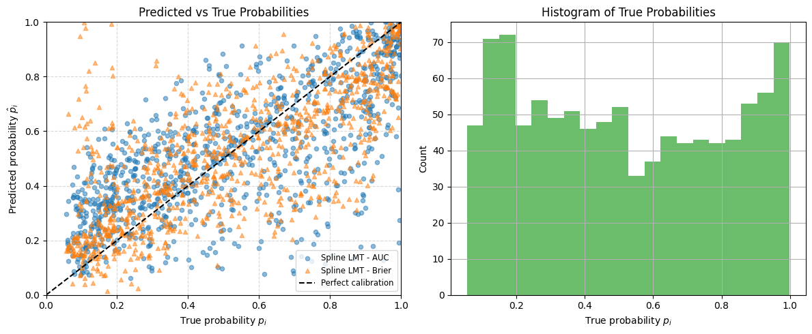
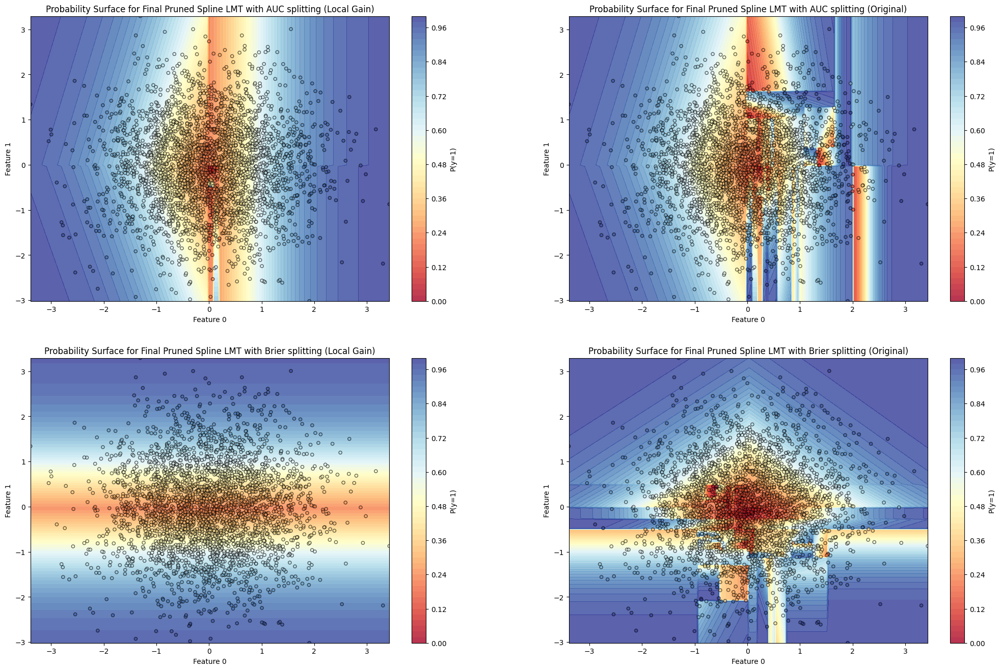
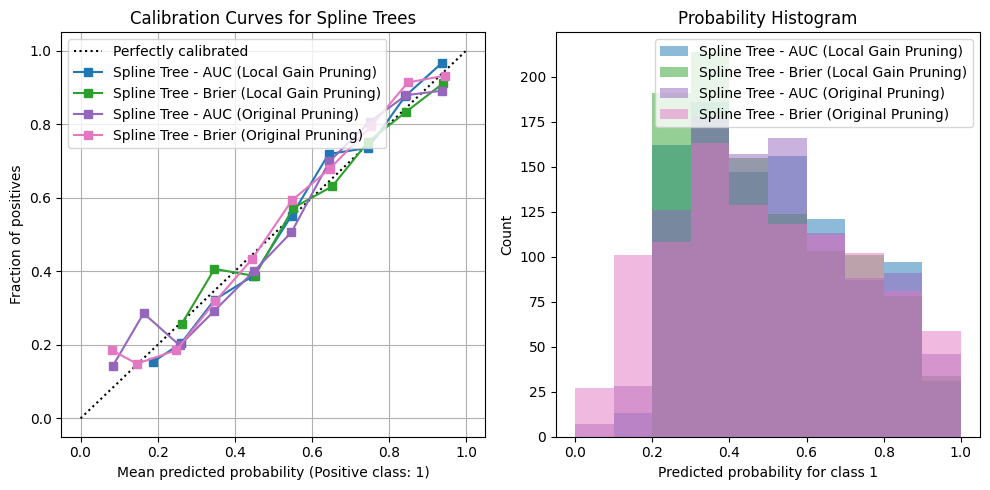
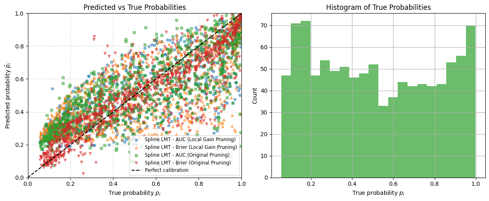

# MVP Experiment — AUC vs. Brier for Tree Growth, then LMT + Regression Pruning

**Goal** 
Compare two split-selection criteria for the Linear–Spline Tree—**weighted AUC** vs. **weighted Brier score**—following the exact growth procedure in `linear_spline_tree.md`. Then, on the grown structures, fit **LogitBoost models at every node (LMT)** as described below and in `LMT_implementation.md`, and apply **Regression Pruning** using the **Original (node-quality)** and **Local-Gain** rules from `regression_pruning.md`, evaluating with **Brier score** and **log loss**.
**Summary.** Across all the final settings, we observed **very similar performance** (pruned LMTs with both Brier score and log loss).

---

## Experimental design

### Data & task

Binary classification throughout. Split details, preprocessing, and feature candidacy match the setup in `linear_spline_tree.md`.
Dataset taken from the **Data Generation Process** (`DGP.md`) with parameters:
 - `n = 5000`
 - `alpha = 2`
 - `r0 = 1.5` 

### Tree growth (plain Linear–Spline Tree)

For each node and for each candidate feature $X_j$ and knot $\tau$:

* **Model fit (parent only).** Fit a logistic GLM on $[1,\;X_j,\;(X_j-\tau)_+]$.
* **Partition.** Split at $X_j \le \tau$ vs. $X_j>\tau$ (enforce minimum child size).
* **Score.** Compute the child metrics using the **parent** model’s probabilities:

  * **Weighted AUC** (maximize)
    $\text{Score}=\frac{n_L}{n}\,\text{AUC}_L+\frac{n_R}{n}\,\text{AUC}_R$
  * **Weighted Brier** (minimize)
    $\text{Score}=\frac{n_L}{n}\,\text{Brier}_L+\frac{n_R}{n}\,\text{Brier}_R$, with $\text{Brier}=\frac{1}{m}\sum (p-y)^2$
* **Select** the best $(j,\tau)$ under AUC or Brier, respectively.
* **Stopping**: `max_depth`, `min_samples`, and node purity as in `linear_spline_tree.md`.

We run **two growth passes** on the same data/config: one using **AUC-based** scoring and one using **Brier-based** scoring. Using the following parameters:
 - `max_depth = 10`
 - `min_samples_leaf = 20`
 - `purity_threshold = 0.85`

> Full mathematical and algorithmic details are in `linear_spline_tree.md`.

---

## LMT fitting on the grown trees

After growth, each internal node and leaf receives a **LogitBoost** classifier:

* **Root CV for iterations.** At the root, perform cross-validation with 5 folds to choose $M^*$, the number of boosting iterations.
* **Warm starts downstream.** Each child node is initialized with its **parent’s weights** and trained for **exactly $M^*$** additional LogitBoost iterations on its reach set.
* **Freezing for pruning.** Once fit, node models $M_v$ are **frozen** for the pruning stage.

> Details and rationale (including score vectors $F_v$ and softmax/probability outputs) are in `LMT_implementation.md`.

---

## Regression pruning (two variants)

We prune the LMT-augmented trees using both rules from `regression_pruning.md`:

1. **Original (node-quality).** Prune a subtree at node $v$ if the node’s own model quality exceeds a threshold (e.g., AUC $>\delta$); the node becomes a leaf holding $M_v$.
2. **Local-Gain.** Keep a split only if the children’s size-weighted quality exceeds the parent’s by at least $\delta$.

**Evaluation losses for pruning selection.** We select $\delta$ via validation by minimizing either **Brier score** or **log loss** on held-out data (both reported).

> See `regression_pruning.md` for exact AUC definitions, multiclass extensions, BFS algorithms, and the $\delta$-selection procedure.

---

## Metrics

We report, for each stage:

1. **Plain trees (no LMT):** AUC, Brier, log loss.
2. **LMT-augmented (no pruning):** AUC, Brier.
3. **Pruned LMTs (Original & Local-Gain):** Brier, log loss (with $\delta$ chosen by CV under Brier and under log loss).

---

## Results (high-level)

* **Growth criterion:** Trees grown with **AUC** vs. **Brier** produced **similar** structures and test performance, but **Brier** tree was better.
* **LMT augmentation:** Adding LogitBoost at nodes in the full grown tree does not improved calibration-sensitive losses for neither growth criteria.
* **Pruning:** The **Original** and **Local-Gain** pruning rules selected comparably compact subtrees with **nearly identical** out-of-sample **Brier** and **log-loss**.
* Overall, **differences across all combinations** (AUC-grown vs. Brier-grown; Original vs. Local-Gain pruning; Brier-selected $\delta$ vs. log-loss-selected $\delta$) were **small and within cross-validation variability**.

**Plain Trees performance**

| Metric      | Spline Tree (AUC) | Spline Tree (Brier) |
| ----------- | ----------------: | ------------------: |
| Accuracy    |          0.719000 |            0.762000 |
| F1 Score    |          0.706374 |            0.769380 |
| AUC-ROC     |          0.719390 |            0.761793 |
| Brier Score |          0.281000 |            0.238000 |
| Log Loss    |         10.128267 |            8.578390 |

**LMT augmentation performance**

| Metric      | Full LMT with Spline Tree (AUC) | Full LMT with Spline Tree (Brier) |
| ----------- | ------------------------------: | --------------------------------: |
| Accuracy    |                        0.688000 |                          0.689000 |
| F1 Score    |                        0.689243 |                          0.695397 |
| AUC-ROC     |                        0.688012 |                          0.688876 |
| Brier Score |                        0.312000 |                          0.311000 |
| Log Loss    |                       11.245620 |                         11.209576 |

**Pruned LMT performance (merged δ-selection results)**

| Metric      | Local Gain (AUC) — same for Brier-δ & LogLoss-δ | Local Gain (Brier) — same for Brier-δ & LogLoss-δ | Original Gain (AUC), Brier-δ | Original Gain (AUC), LogLoss-δ | Original Gain (Brier) — same for Brier-δ & LogLoss-δ |
| ----------- | ----------------------------------------------: | ------------------------------------------------: | ---------------------------: | -----------------------------: | ---------------------------------------------------: |
| Accuracy    |                                        0.708000 |                                          0.672000 |                     0.702000 |                       0.707000 |                                             0.736000 |
| F1 Score    |                                        0.706827 |                                          0.652542 |                     0.704365 |                       0.708458 |                                             0.729508 |
| AUC-ROC     |                                        0.708077 |                                          0.672491 |                     0.701981 |                       0.707005 |                                             0.736239 |
| Brier Score |                                        0.292000 |                                          0.328000 |                     0.298000 |                       0.293000 |                                             0.264000 |
| Log Loss    |                                       10.524747 |                                         11.822318 |                    10.741009 |                      10.560790 |                                             9.515524 |

**Notes.**

* The **Local Gain** results are **identical** whether δ is chosen via **Brier score** or **log loss**, so they are shown once.
* For **Original Gain**, the **(Brier)** column is also identical across δ-selection methods.
* The only differences between δ-selection criteria appear in **Original Gain (AUC)**.

---

## Visualization placeholders

1. **Decision regions — Plain trees**
    
    
   * Axis-aligned regions induced by Linear–Spline Tree with AUC vs. Brier split scoring.   
    

   
   * Calibration curves and probability histograms induced by Linear–Spline Tree with AUC vs. Brier split scoring.  
    

   
   * True vs Predicted probabilities scatter plot and true probabilities histogram induced by Linear–Spline Tree with AUC vs. Brier split scoring. 
    

2. **Decision regions — LMT at nodes (unpruned)**
    
    
   * Effect of LogitBoost-at-node on local decision surfaces.
    

   
   * Calibration curves and probability histograms induced by full LMT with AUC vs. Brier split scoring. 
    

   
   * True vs Predicted probailities induced by full LMT with AUC vs. Brier split scoring. 
    

3. **Decision regions — Pruned LMTs**

   
   * Subtree simplification with comparable boundaries post-pruning.
    

   
   * Calibration curves and histograms for pruned trees with Brier score.
    

   
   * True vs Predicted probailities induced by pruned LMT. 

---

## Reproducibility (concise)

* **Candidate knots:** percentiles (e.g., 10–90 by 10s) as in `linear_spline_tree.md`.
* **Min child size, max depth, purity threshold:** same values used for both growth criteria.
* **Pruning thresholds:** grid $\Delta$ and $5$-fold CV defined as follows:
    - `deltas_original = np.linspace(0.60, 0.90, 20)`
    - `deltas_local = np.linspace(0, 0.0025, 20)`
* **Random seeds & splits:** fixed and shared across all runs.

---

## Takeaways

* Using **Brier** to select splits for Linear–Spline Trees leads to a better performance.
* **LMT-at-node** in the full grown tree provides a worse calibration and discrimination lift regardless of the growth criterion.
* **Regression Pruning**—either **Original** or **Local-Gain**—yields **similarly compact** trees with **nearly indistinguishable** Brier and log-loss on validation/test data and a better performance compared to the full grown tree.

> For complete mathematical detail and algorithms, see:
> • `linear_spline_tree.md` (growth & scoring)
> • `LMT_implementation.md` (LogitBoost-at-node fitting & warm starts)
> • `regression_pruning.md` (Original & Local-Gain pruning, $\delta$-selection)
