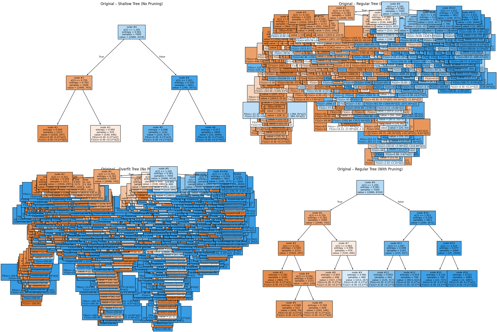
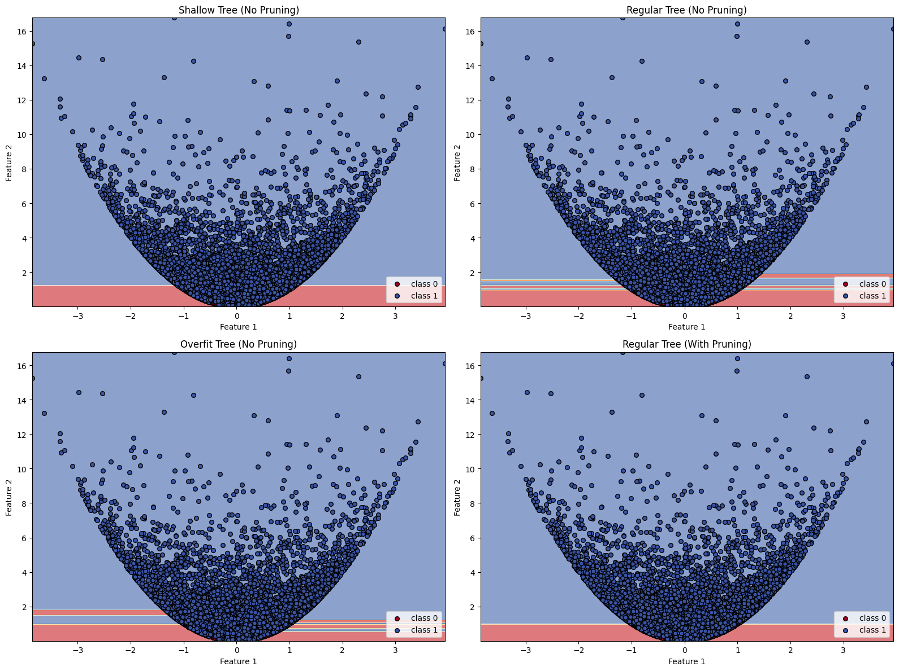
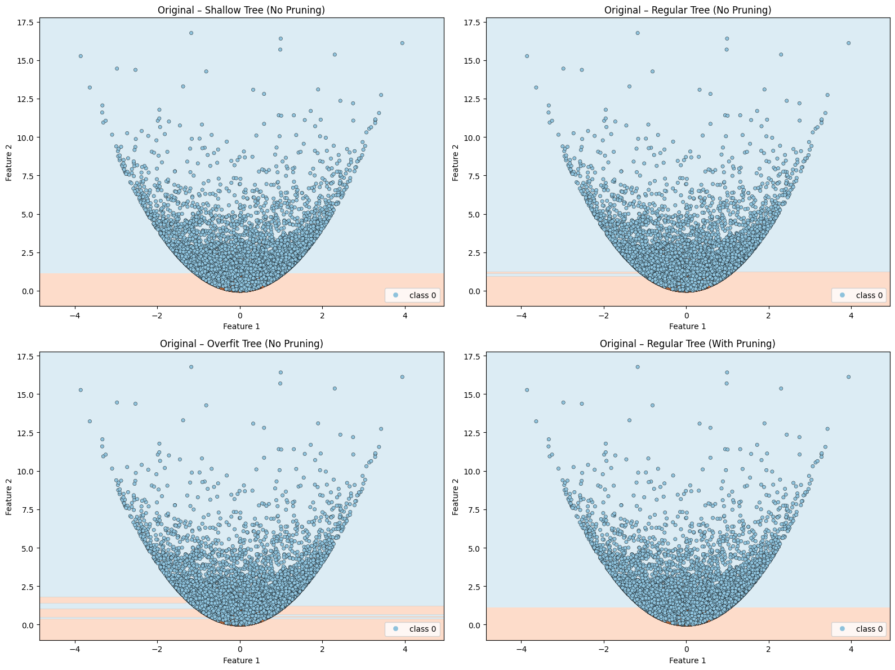
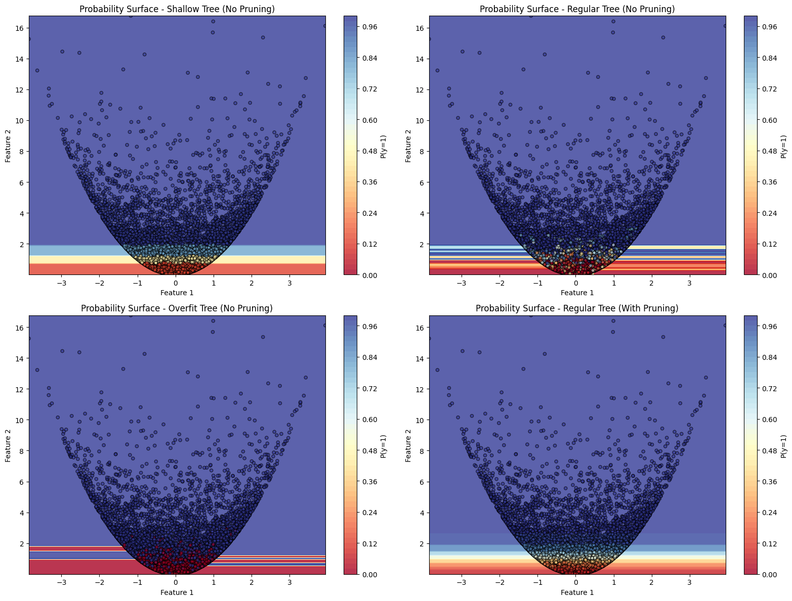
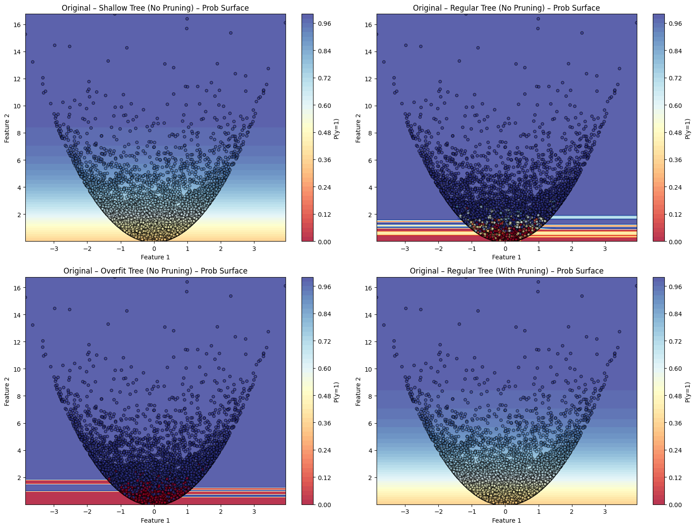

# LMT — final implementation

A **Logistic Model Tree (LMT)** combines a decision‐tree structure (for space partitioning) with **LogitBoost** logistic models fitted on the samples reaching each node. The result is a tree that routes $x$ to a leaf and then predicts with a local logistic model.

---

## 1) Tree construction

### `construct_tree(X, y, size='regular', pruning=False, pruning_show_stats=False, cv=5, scoring='accuracy', random_state=0)`

* **Base learner**: scikit-learn `DecisionTreeClassifier` with `criterion='entropy'` (C4.5-style impurity).
* **Depth/regularization presets (`size`)**

  ```
  'shallow' : max_depth=2,  min_samples_leaf=20, min_samples_split=40
  'regular' :           ,  min_samples_leaf=5,  min_samples_split=15   # paper defaults
  'overfit' : max_depth=None, min_samples_leaf=1, min_samples_split=2
  ```
* **CART-like pruning (optional)**: If `pruning=True`, the code:

  1. Computes the **minimal cost-complexity pruning path** (`cost_complexity_pruning_path`) to get candidate `ccp_alpha` values (skips `0.0` so something gets pruned).
  2. For each alpha, fits a tree **with entropy** and evaluates it via `cross_val_score(X, y, cv=cv, scoring=scoring)`.
  3. Picks the **best alpha** and refits on all data.
  4. If `pruning_show_stats=True`, prints the chosen alpha and plots **alpha vs. CV score**.
* **Exact paper replication**: Set `size='regular'` and `pruning=True`.

> Return: the fitted (optionally pruned) `DecisionTreeClassifier`.

---

## 2) Logistic models at the nodes

The tree provides the routing; the **per-node classifiers** are trained with LogitBoost. Two variants are implemented.

### Variant A — SimpleLogistic at every node

`fit_logistic_model_tree(X, y, size='regular', pruning=True, tree_random_state=0, lb_n_estimators=200, lb_eps=1e-5, lb_cv_splits=5, lb_random_state=0)`

1. **Fit the structure** using `construct_tree(...)`.
2. Precompute `decision_path(X)` (sparse $N \times$ nodes matrix) so we can mask samples reaching any node quickly.
3. **Recursive pass over nodes**:

   * For node `t`, build `X_t, y_t` by masking rows that passed through `t`.
   * Pick a **stratified CV fold count** $k\le$ min class count in `y_t`. If a class has fewer than 2 samples, **skip CV** for this node.
   * If CV is possible: run `simple_logistic_fit(X_t, y_t, n_estimators=lb_n_estimators, eps=lb_eps, cv_splits=k, warm_start=parent_model)` to get:

     * `learners` (the per-round weak learners),
     * `J` (classes present at this node),
     * `M_star` (round chosen by CV),
     * `cv_errors` (validation curve).
   * If CV is **not** possible: run plain `logitboost_fit(...)` (no CV); store `learners`, `J`, and set `cv_errors=None`.
   * **Warm-start**: children inherit the parent’s `(learners, J)` as initialization.
4. Store results in a dictionary
   `node_models[node_id] = {'learners', 'J', 'M_star', 'cv_errors'}`.

> Return: `(clf_tree, node_models)`.

### Variant B — SimpleLogistic only at the root (5× faster)

`fit_logistic_model_tree_v2(...)`

* Run `simple_logistic_fit` **only at the root** to select $M^*$.
* For **every other node**, run standard `logitboost_fit` for exactly $M^*$ rounds, **warm-starting** from the parent.
* The rest (decision path, recursion, storage) matches Variant A.

> In practice this is substantially faster with **little to no drop** in accuracy relative to Variant A.

---

## 3) Prediction

### Binary (`J=2`)

* Route $x$ down the fitted tree to its **leaf id** $\ell$.
* Let the leaf store `learners` and `J`. Compute

  $$
    \hat{\mathbf p}(x)=\operatorname{softmax}\big(F(x)\big),\qquad
    F(x)=\sum_{m=1}^{M_\ell} f_m(x)
  $$

  with the leaf’s LogitBoost model. Return $\hat p(y=1\mid x)$ or the hard label $\mathbb{1}\{\hat p\ge 0.5\}$.

### Multiclass (`J>2`)

* Each leaf keeps a **local $J_\ell$-class** model. Probabilities are computed with the leaf’s softmax and (if needed) placed into a global $(N\times J_{\max})$ matrix.

### API

* `predict_lmt(X, clf_tree, node_models)` → hard labels by routing to the leaf and calling the leaf’s LogitBoost **classifier**.
* `predict_proba_lmt(X, clf_tree, node_models)` → $P(y=1)$ for each row (handles **degenerate leaves** with a single class by returning 0 or 1 accordingly).
* Multiclass counterparts: `predict_lmt_multiclass(...)`, `predict_proba_lmt_multiclass(...)`.

---

## 4) Optional “regression” pruning (node-model AUC)

`regression_pruning(X_train, y_train, clf, nodes_models, threshold, verbose=False, multiclass=False, average='macro')`

* Walk internal nodes breadth-first.
* For each node, evaluate the **local LogitBoost model** on the samples that reach the node:

  * Binary: `roc_auc_score(y_node, p_node[:,1])`
  * Multiclass: `roc_auc_score(y_node, p_node, average='macro')`
  * If the node’s subset has **one class**, treat AUC as `1.0`.
* If **AUC ≥ threshold**, **prune the children** (keep the node’s own model only).
  Intuition: when the node’s local logistic model is already strong, the extra subtree adds little.

Returns the pruned tree and the set of pruned node ids.

---

## 5) Visualization utilities

* `plot_tree_with_linear_models(clf_tree, node_models, X, title, class_names=None, show_internal=False, model_threshold=1e-6, ax=None)`
  Draws the entropy tree and **prints the per-node linear models** (intercept + coefficients with $|w_k|>$ `model_threshold`).
  Set `show_internal=True` to annotate non-leaf nodes as well (can be messy on high-D data).
  An example how does it look like is shown below:
  <br>

  
  <br>

* `plot_tree_decision_surface(X, y, feature_pair, size='regular', pruning=False, feature_names=None, class_names=None, plot_step=0.02, cmap=plt.cm.RdYlBu, ax=None)`
  For two chosen features, shows the **tree’s hard regions**.
  An example is shown below:
  
  
  <br>

* `plot_decision_regions_lmt(X, y, clf_lmt, nodes_lmt, tree_model='original', feature_pair=(0,1), fill_value='mean', grid_steps=200, cmap='RdYlBu', ax=None, title=...)`
  2D hard decision regions from the **LMT** predictions (original or, if you built one, a composite-tree variant).
  
  <br>

* `plot_probability_surface_tree(...)` and `plot_probability_surface_lmt(...)`
  Smooth **probability surfaces** $P(y=c)$ on a 2D plane spanned by a feature pair; other features are fixed to the mean (or user-specified `fixed_vals`). Training points are overlaid and colored by their predicted probabilities.
  Both examples are shown below:
  For Trees
  
  <br>

  For LMT
  

---

## Notes & good practices

* **Numerics**: LogitBoost in the attached code uses **probability clipping** and a stable softmax; degenerate leaves (single class) are handled explicitly.
* **Warm-starts**: Passing a parent’s model to children provides **faster convergence** and more stable estimates in small nodes.
* **When to stop**: Prefer **Variant B** for speed; it uses the root’s CV-selected $M^*$ everywhere. Use **Variant A** when you want the *per-node* $M^*$ chosen by local CV.
* **Paper settings**: If you want the closest analogue to the original LMT paper, use `size='regular'` and `pruning=True`, entropy criterion, and SimpleLogistic as described above.

That’s the full picture: entropy tree for routing; LogitBoost models at nodes; optional cost-complexity + AUC-based pruning; and plot helpers for structure, hard regions, and probability surfaces.
