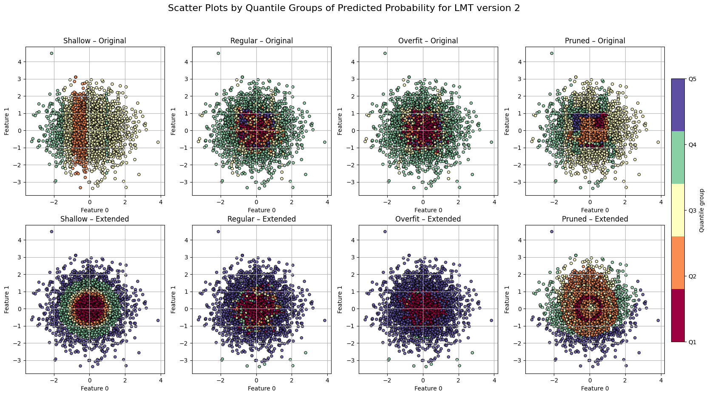

# Calibration: how to *see* it

To compare calibration across models and datasets, we use three complementary visualizations. Below, $(x_i, y_i)_{i=1}^n$ are test samples with labels $y_i\in\{0,1\}$ and predicted probabilities $p_i\in[0,1]$.

---

## 1) Calibration curves (reliability diagrams)

These show how predicted probabilities align with observed frequencies.

**Construction**

1. Partition $[0,1]$ into $M$ equal-width bins $I_m=\big(\tfrac{m-1}{M},\tfrac{m}{M}\big]$.
2. Let $B_m=\{i: p_i\in I_m\}$ and $N_m=|B_m|$.
3. For each bin compute

   $$
   \bar p_m=\frac{1}{N_m}\sum_{i\in B_m} p_i,\qquad
   \hat\pi_m=\frac{1}{N_m}\sum_{i\in B_m} y_i.
   $$
4. Plot the points $(\bar p_m,\hat\pi_m)$, optionally joined by line segments.
   The diagonal $y=x$ is the ideal calibration line.

**Reading the plot**

* Curve **above** $y=x$: under-confident (probabilities too low).
* Curve **below** $y=x$: over-confident (probabilities too high).
* Deviation $\hat\pi_m-\bar p_m$ within each bin quantifies local miscalibration.

*Calibration Curves of MVP experiment, LMT with linear spline tree and regression pruning*

---

## 2) Scatter plot stratified by probability quantiles

A qualitative view that links spatial structure (on the first two features) to the model’s confidence.

**Construction**

1. Compute each point’s predicted probability $p_i$ for the positive class.
2. Sort $\{p_i\}$ and split into five equal-mass groups (quintiles) $Q_1,\dots,Q_5$:

   * $Q_1$: the 20% least likely to be positive,
   * $\dots$
   * $Q_5$: the 20% most likely to be positive.
3. Plot the test points in the plane of the first two features, coloring by quintile.

**Comparing multiple models on the same figure**

* Use a **shared color scale** built from the pooled set of probabilities across all shown models; this makes colors comparable.
* A given model may **not display all five colors** if none of its points fall into some pooled quintile ranges.

*Scatter plot by quantiles of Original LMT, with SimpleLogistic just at the root node*

---

## 3) True vs. predicted probabilities

This compares predicted probabilities to the *true* event probabilities.

* **When ground-truth probabilities $\pi_i=\Pr(Y=1\mid x_i)$ are known** (e.g., in simulations), scatter $(p_i,\pi_i)$ and compare to $y=x$.
* **When $\pi_i$ is unknown** (real data), use a consistent estimate of $\Pr(Y=1\mid p)$ such as isotonic regression or local logistic smoothing:

  $$
  \tilde\pi(p)\approx \mathbb{E}[Y\mid P=p],\quad\text{then plot }(p_i,\tilde\pi(p_i)).
  $$

Points above $y=x$ indicate under-confidence; below indicate over-confidence.

*True vs Predicted plot of MVP experiment, LMT with linear spline tree and regression pruning*
